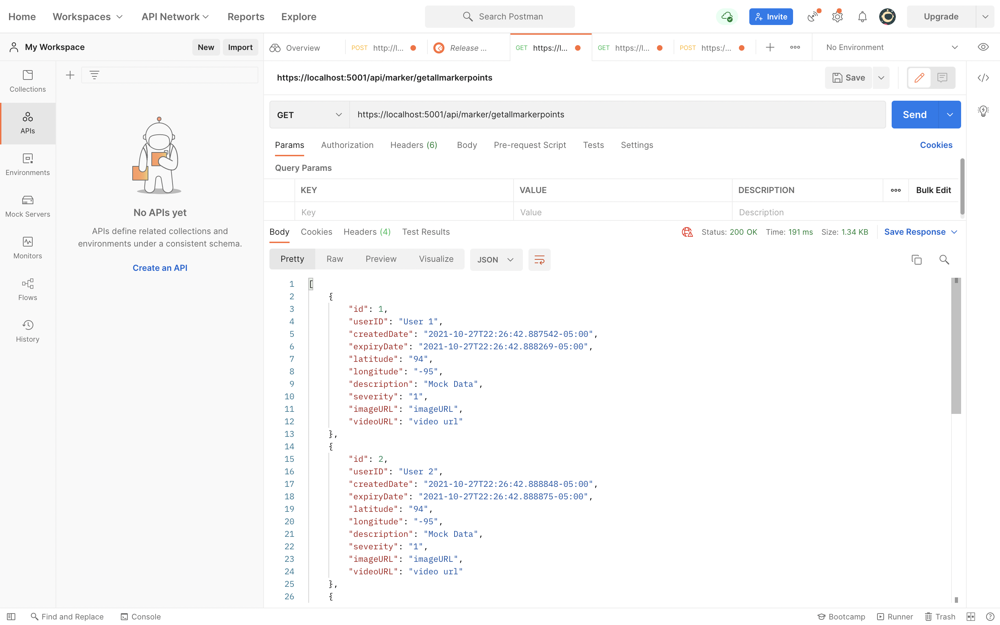
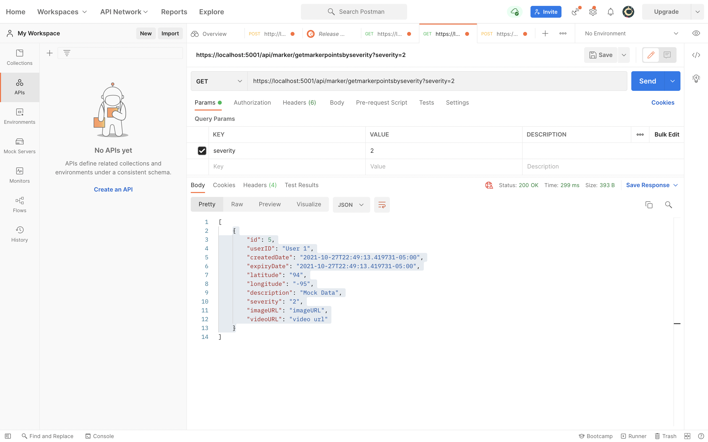
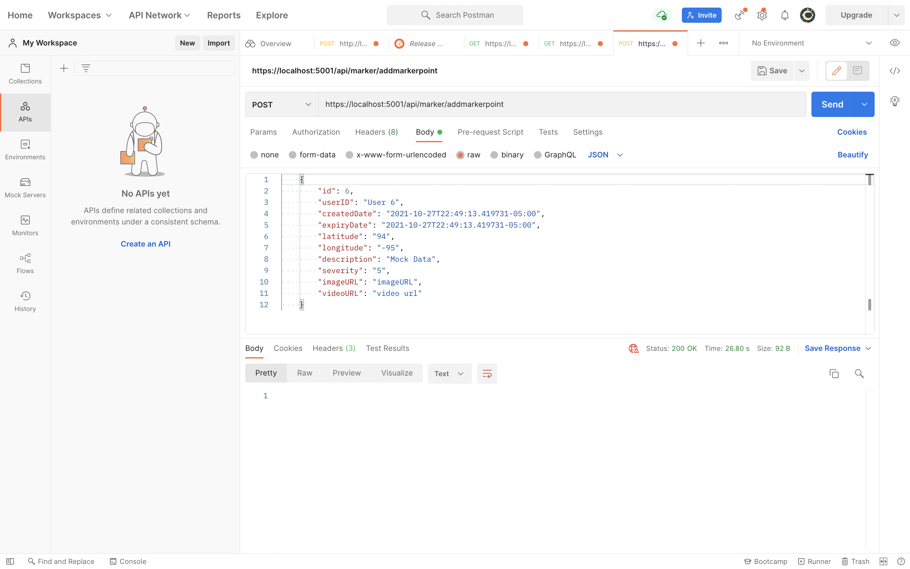

## Description
This project is a .NET core implemented Web API for listing all of the markerpoints.

## Building and Running
1. Change to the api directory (i.e. `NextFloodAPI/NextFloodAPI`)

    `cd NextFloodAPI`

2. Issue the dotnet restore command (this resolves all NuGet packages)

    `dotnet restore`

3. Issue the dotnet build command

    `dotnet build`

4. Issue the dotnet run command

    `dotnet run`

  This will start the Kestrel webserver, load the `NextFloodAPI` application and tell you, via the terminal, what the url to access `NextFloodAPI` will be. Usually 
this will be `http://localhost:5000`, but it may be different based on your system configuration.

GET all MarkerPoints

```https://localhost:5001/api/marker/getallmarkerpoints```



GET MarkerPointsBySeverity

```https://localhost:5001/api/marker/getmarkerpointsbyseverity?severity=2```



ADD new MarkerPoint

```https://localhost:5001/api/marker/addmarkerpoint```



GET MarkerPointById

```https://localhost:5001/api/marker/getmarkerpointsbyid?id=2```


## Hosting the API

The API will be hosted on `AWS lambda` and `API Gateway` and the resultant link will be provided to get access to 
